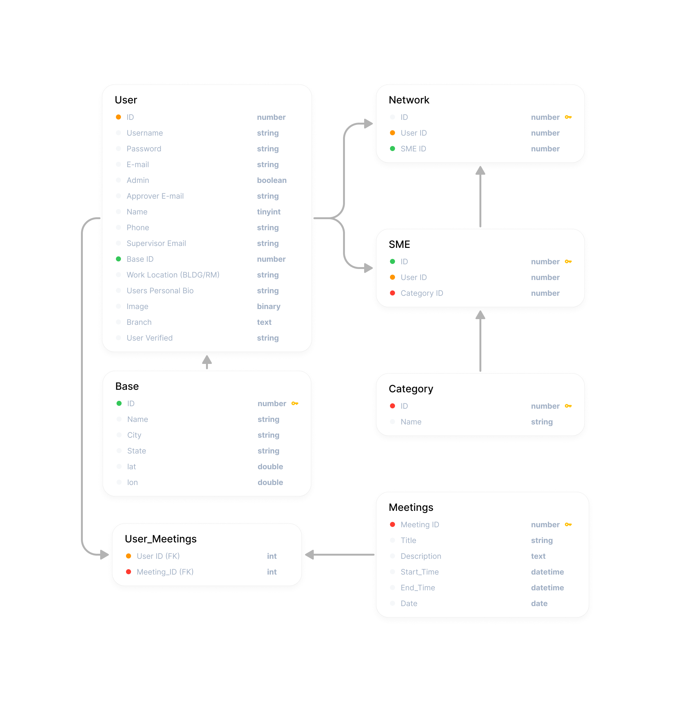

# Database Design:
# 

# Installation Instructions
1. Clone project into a directory.
2. Ensure Docker is running.

## Start API Server and Database
3. Open a terminal and go into the server directory: `cd /back/server`
4. Add a hidden environmental file: `touch .env`
5. Add the following two lines to the .env file:
		a. “DB_CONNECTION_STRING=postgres::docker@localhost:5432/smeid”
		b. “POSTGRE_PASSWORD=$$$$$$” where $$$$$ = postgres password
6. Run `npm install`
7. run `npm start`

## Start user interface server (frontend)
8. Open another terminal and go into the sme directory: `cd /front/sme`
9. Run `npm install`
10. Run `npm start`

# List of APIs that can be found in the /back/server/src/app.js
## Login
1. Returns userid, firstname, lastname for a verified username/password
		POST request to //localhost:3001/login/
### Creating POST request for Login
Requires credentials (user name, password) in request body. Example: username="user1" and password = "password1".
Body should be in JSON format:

				{
					"user": "user1",
					"pw": "password1
				}
### API returns userid, firstname, and lastname in the response's body. Example:
			[
				{
					"userid": 1,
					"firstname": "John",
					"lastname": "Doe"
				}
			]

## "Meetings" table
1. Return all data in meetings table
			GET request to //localhost:3001/meetinglist
2. Return all users (user_id) attending  a specific meeting
			GET request to //localhost:3001/listameeting/:meetingid
3. Return all meetings a specific user is attending
			GET request to //localhost:3001/usermeetings/:userid
4. Add a new meeting to meeting table
			POST request to //localhost:3001/meetings
5. Delete a meeting in meeting table
			DELETE request to //localhost:3001/meetings
		NOTE: also deletes all user/meeting references in “usermeetings” table

## “Network” Table
1. Return all data in network table (user to sme relationships)
			GET request to //localhost:3001/network
2. Add a specific SME to specific user relationship (assigns SME to a user)
			POST request to //localhost:3001/network
3. Removes a specific SME to specific user relationship (deletes SME
	 assignment to a user)
			DELETE request to //localhost:3001/deletenetworkSME

## “base” Table
1. Return all data in base table
			GET request to //localhost:3001/base
2. Add a new base to base table
			POST request to //localhost:3001/createbase
3. Modify existing base information to base table
			PATCH request to //localhost:3001/updatebase
4. Removes a base from base table
			DELETE request to //localhost:3001/deletebase

## “usermeeting” Table
1. Add a user to a meeting
			POST request to //localhost:3001//attendmeeting'
### Assigning users to a meeting:
Requires credentials (user name, password) in request body. Example user_id = 5 and meeting_id = 9.
Body should be in JSON format:

				{
					"user_id": 5,
					"meeting_id":9
				}
### API returns userid, firstname, and lastname in the response's body. Example:
			[
				{
					"userid": 1,
					"firstname": "John",
					"lastname": "Doe"
				}
			]

2. Delete a user from a meeting
			DELETE request to //localhost:3001/deleteuserfrommeeting

## “category” Table
1. Return all data in category table
			GET request to //localhost:3001/categories
2. Add a new category to category table
			POST request to //localhost:3001/createcategory
3. Modify existing category information to category table
			PATCH request to //localhost:3001/updatecategory
4. Delete a SME category from a category table
			DELETE request to //localhost:3001/deletecategoy

## “user” Table APIs
1. Get all data in users
			GET request to //localhost:3001/
2. Get a list of all usernames
			GET request to //localhost:3001/getusers'
3. Add a new user to the user table
			POST request to //localhost:3001/createuser
4. Update a user information
			PATCH request to //localhost:3001/updateuser
5. API provides suggestions for user search
			PATCH request to //localhost:3001/suggest
6. Delete a user from users table
			DELETE request to //localhost:3001/deleteuser/:userid

## Profile API
1. Get user data for a profile component for a specified userid
			GET request to //localhost:3001/profile/:userid'

## “sme” Table
1. Get SME table data
			GET request to //localhost:3001/smes
2. Get SME table data fpr a specific user
			GET request to //localhost:3001/smes/:id'
3. Add new user/sme category relationship
			POST request to //localhost:3001/smes
4. Remove a user/sme category relationship
			DELETE request to //localhost:3001/smes